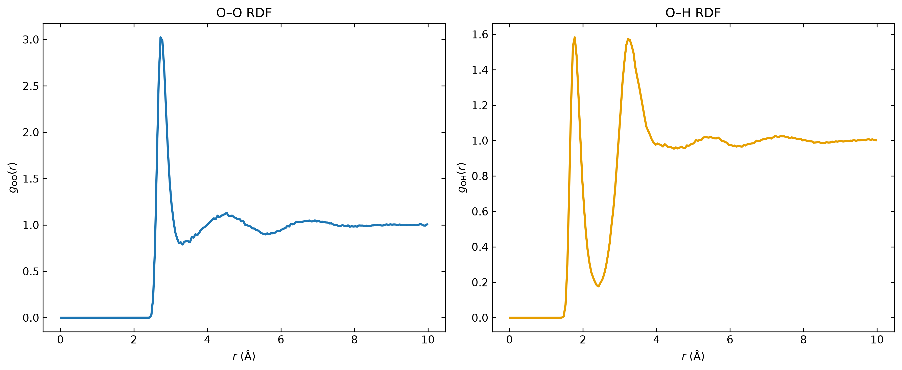
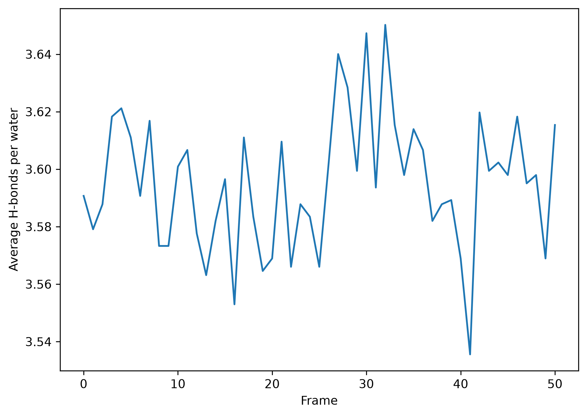
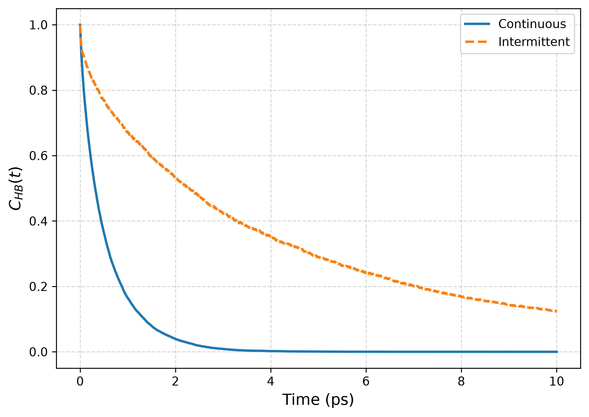
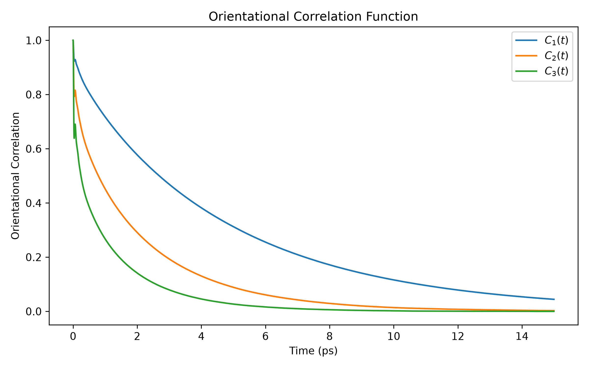
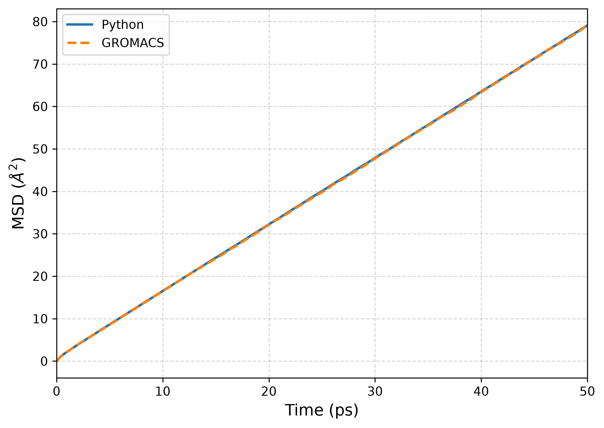

# Example figures

This directory contains representative figures generated from the analysis scripts in `scripts/`.

## RDF

**O–O radial distribution function**

`rdf_example.png` — Example oxygen–oxygen radial distribution function.

## Hydrogen bonds

**Hydrogen-bond population**

`hbond_example.png` — Example hydrogen-bond population analysis.

**Hydrogen-bond lifetime**

`hb_lifetime_example.png` — Example continuous and intermittent hydrogen-bond lifetime analysis.

## Orientational correlation

**O–H rotational correlation functions**

`p1_p2_p3_correlation.png` — Example first-, second-, and third-rank rotational correlation functions (P1, P2, and P3) of O–H bond vectors.

## MSD

**Mean-squared displacement**

`msd_example.png` — Example oxygen mean-squared displacement analysis.

These figures are included only as examples of the analysis output. The underlying production data and CSV files are not stored in the repository.
